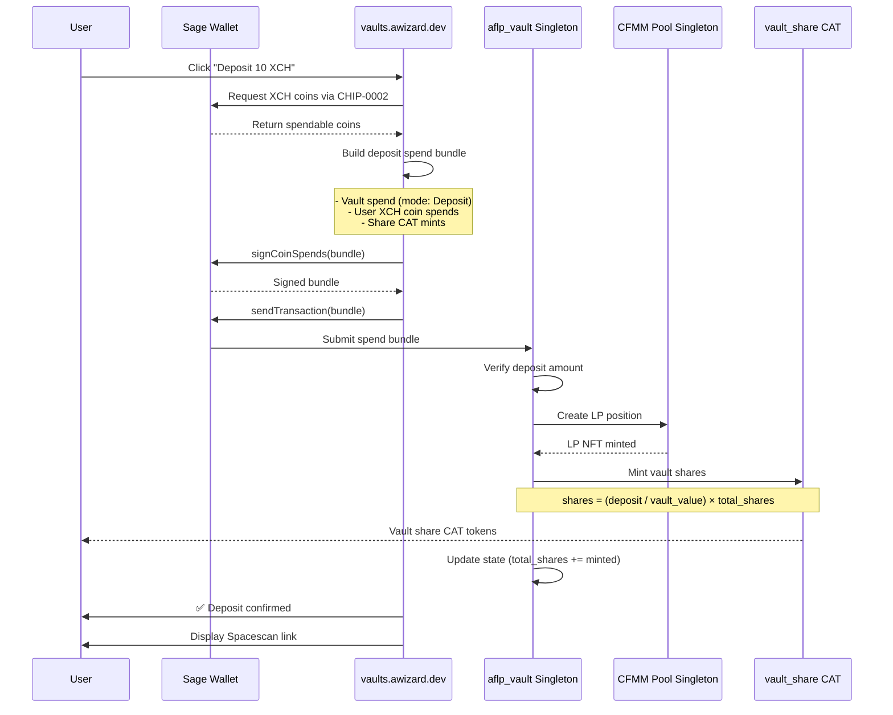
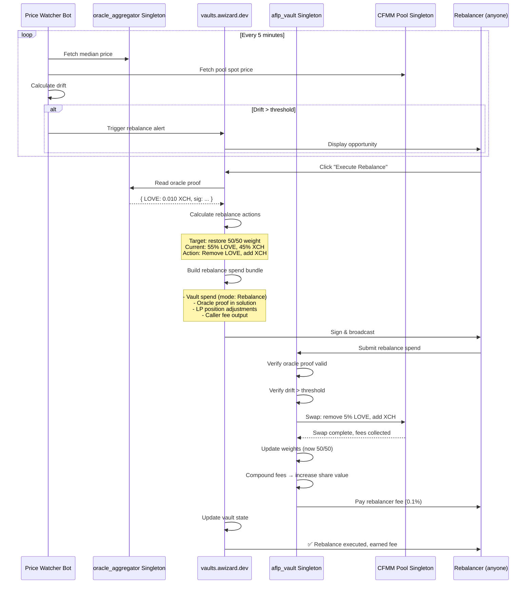
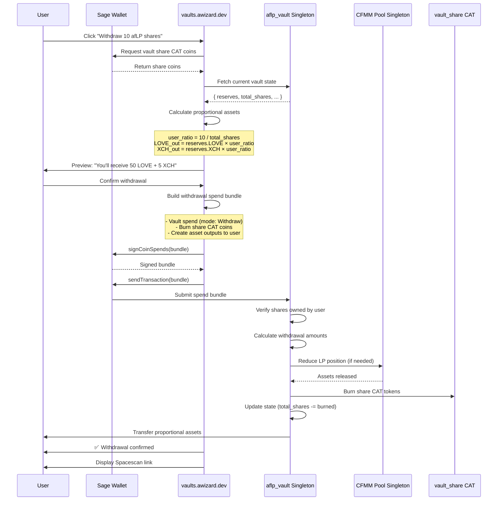
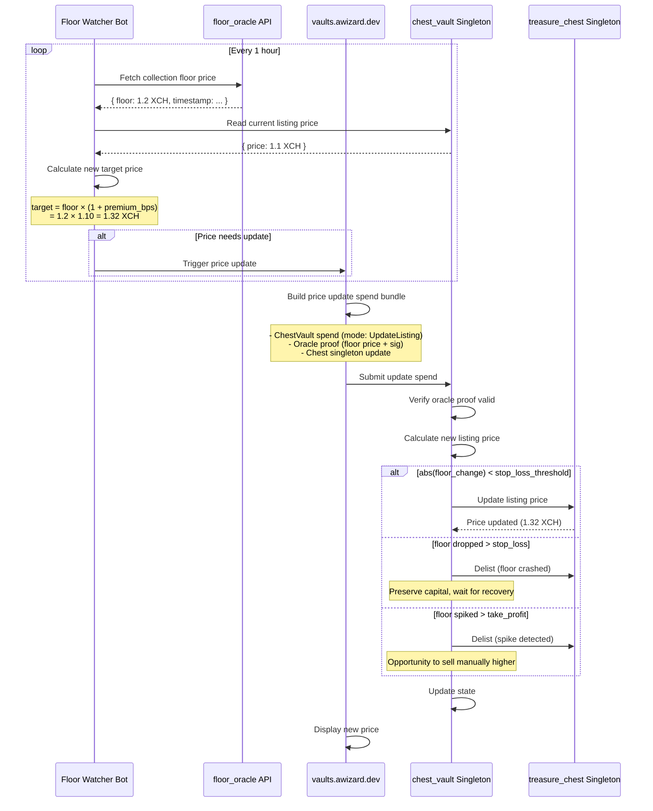
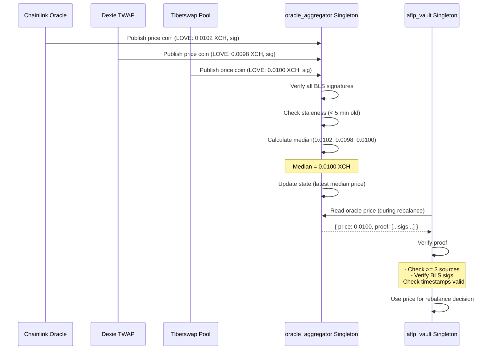
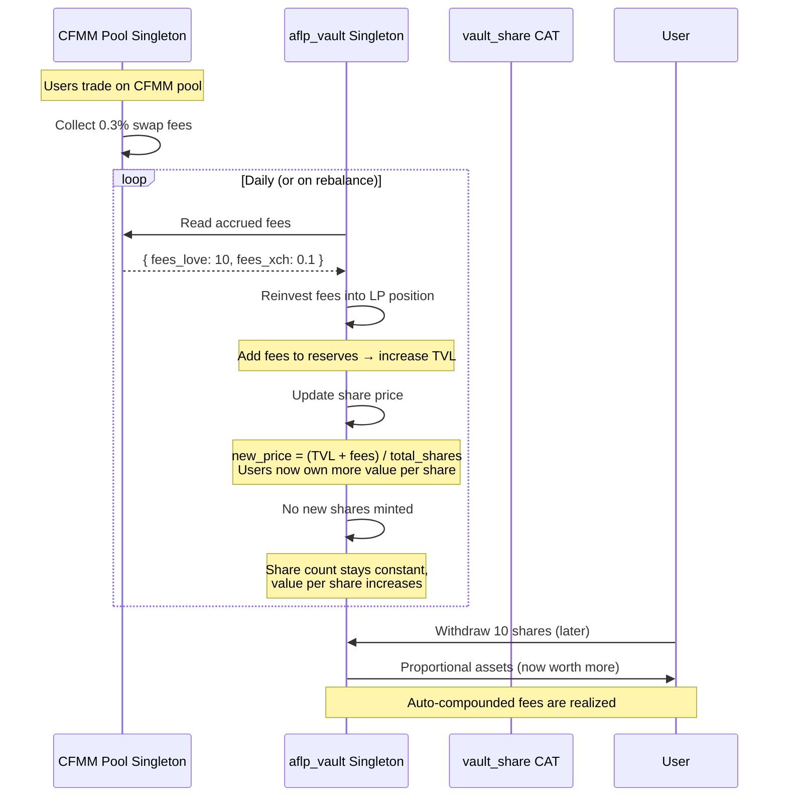

# Vault Balancer — Contract Interaction Flow

## 1. Deposit Flow



---

## 2. Rebalance Flow (Permissionless)



---

## 3. Withdraw Flow



---

## 4. Chest Vault Price Update Flow



---

## 5. Oracle Aggregation Flow



---

## 6. Auto-Compounding Flow



---

## Key Contract Invariants

### aflp_vault Singleton

**Assertions on every spend:**
```clojure
(assert (>= (+ deposit_amount current_reserves) MIN_TVL))
(assert (= (+ new_shares total_shares) expected_total))
(assert (<= performance_fee_taken (* pnl performance_fee_bps)))
(assert (verify-oracle-proof oracle_proof oracle_pubkey))
(assert (or (< drift rebalance_threshold) (= spend_mode Rebalance)))
```

**State transitions:**
- `Deposit`: reserves ↑, total_shares ↑, LP positions ↑
- `Withdraw`: reserves ↓, total_shares ↓, LP positions ↓ (if needed)
- `Rebalance`: weights adjust, share_price may ↑ (from arb capture)
- `CompoundFees`: share_price ↑, total_shares unchanged

---

## Security Considerations

### Oracle Manipulation
**Attack:** Attacker publishes fake oracle price to trigger bad rebalance  
**Defense:** Require median of 3+ independent sources, all with valid BLS signatures

### Vault Drain Attack
**Attack:** Malicious rebalancer tries to drain vault via crafted rebalance  
**Defense:** Contract verifies rebalance restores target weights, slippage limits enforced

### Flash Loan Attack
**Attack:** Deposit → trigger rebalance → withdraw to capture arb  
**Defense:** 0.1% withdrawal fee + rebalance cooldown (min 1 hour between rebalances)

### Share Price Manipulation
**Attack:** Large deposit right before fee compound to dilute existing holders  
**Defense:** Fee compounding is continuous (every rebalance), not batched

---

## Gas / Cost Estimates (Chia)

| Operation | CLVM Cost (est.) | Mojos Fee (testnet11) |
|-----------|------------------|----------------------|
| Deposit | ~50M cost | ~0.00005 XCH |
| Withdraw | ~30M cost | ~0.00003 XCH |
| Rebalance | ~100M cost | ~0.0001 XCH |
| Oracle update | ~20M cost | ~0.00002 XCH |

*Note: Actual costs depend on pool complexity and number of assets*

---

**Diagram version:** 1.0  
**Last updated:** March 5, 2026  
**Next:** Implement vaultBalancer.ts math library
